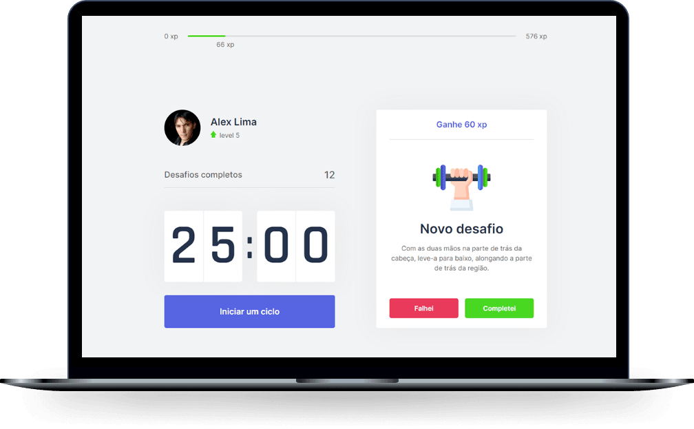
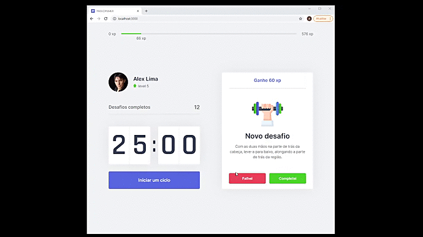
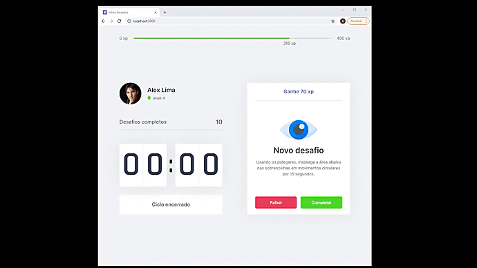

<!---------- Title/ Logo -------------->

<h1 align="center">
  
</h1>

<!-- ------- Ancoras --------------->
<p align="center">
  <a href="#-sobre">Sobre</a>&nbsp;&nbsp;&nbsp;|&nbsp;&nbsp;&nbsp;
  <a href="#-projeto">Projeto</a>&nbsp;&nbsp;&nbsp;|&nbsp;&nbsp;&nbsp;
  <a href="#-telas">Telas</a>&nbsp;&nbsp;&nbsp;|&nbsp;&nbsp;&nbsp;
  <a href="#-tecnologias">Tecnologias</a>&nbsp;&nbsp;&nbsp;|&nbsp;&nbsp;&nbsp;
  <a href="#memo-licença">Licença</a>
  <p align="center">

<!---------- Badges ----------------->  

  <!--  -->

   
  <!-- 
   -->

  

  <!--  -->
 
  

  

  <!--   -->
  <!-- --(4953b8)--blueDark -->
  <!-- --(49AA26)--Green -->

<!---------- showcase  ----------------->  
<p align="center">
  
</p>

 <!----- Acess Deploy Demonstration-->
 <h5 align="center">
    🎬 Clique Aqui: &nbsp; <a href="https://moveit-alxlima.vercel.app/">  Visualizar Demonstração </a> 
 </h5>


 <!----- Description ------------------>

## 🔖 Sobre

 #### Este projeto é parte do evento que participei o **Next Level Week #4** conhecido como **NLW** da [Rocketseat](https://rocketseat.com.br). Foi uma semana de maratona de estudos sobre desenvolvimento Web(Front-End), em sua 4° edição. O projeto denominado **Move-It**, teve como objetivo criar um aplicativo para contabilizar inicio de ciclos de tempo com foco em intervalos com desafios de exercícios propostos para o bem estar e saúde.
 #### O sistema **Move-It**, é uma aplicação que te ajudara a se exercitar após longas horas de trabalho em frente ao computador, possibilitando realizar o controle do seu tempo e o foco nas atividades. A cada pausa é automaticamente aplicado um sorteio de novos desafios com detalhes de exercícios e atividades saudáveis a serem realizadas, ao concluir é contabilizado os status de experiência do usuário, incluindo seu ganho total de experiências a os níveis de cada level e quantidade de desafios concluídos.
  
  <br>

  ## 💻 Projeto
  
  ####  Sua construção e desenvolvimento foi através de arquitetura de componentes do **React.js** e **Next.js**, utilizando dependências das bibliotecas **TypeScript**, aplicando conceitos de utilização de componentes aplicados a contextos, que tem a vantagens de poder ser consumidos em requisições clientes **API**. O conceito da aplicação  se resume na criação de um **Countdown**, que dispara um ciclo de início e após o término sorteia um desafio a ser realizado para que você faça pausas durante o dia cansativo de trabalho. A ideia tem base na técnica de [Pomodoro](https://pomofocus.io/), com o objetivo de melhorar sua produtividade e foco. 
  #### Contem a aplicação de eventos de notificações Windows, efeitos sonoros, apresentações de resultados de level através de animações em show Modal, contudo contabilizados em calculo máximos de experiência atingida.
 #### Como persistência de armazenamento de dados, utilizado o conceito de salvamento no próprio Web Browser, através de **Cookies** incluindo aplicação de tipagems do js-cookie para o **NDM**.

<br>

 ###### **Evento :** Maratona -NLW 4ª Edição - [Rocketseat](https://rocketseat.com.br)
 ###### **Instrutor :** Diego Fernandes
<br>

 <!----- Showcase Screens Shot------------------>

## 💻 **Telas**

<div align="center">



</div>
<br>
<br>

<!----- Configurations ---------------------------->

## 📌 Instruções : 

Para iniciar o Servidor da aplicação use o comando: **_npm run dev_** então acesse pelo navegador **_http://localhost:3000/_** 

<br>

## 🚀 Tecnologias


- [HTML5](https://pt.wikipedia.org/wiki/HTML5) - Hyper Text Markup Language -linguagem de marcação de hipertexto.
- [CSS3](https://pt.wikipedia.org/wiki/CSS3) - Cascading Style Sheets - estilização de código html.

- [React](https://reactjs.org/) -Biblioteca JavaScript para criação de Interfaces (Front-End)
- [Next.js](https://nextjs.org/) - Framework React com foco em produção e eficiência.
- [TypeScript](https://www.typescriptlang.org/) - Conjunto da linguagem JavaScript com definições de tipo estático.
- [VS Code](https://code.visualstudio.com/) - Editor de desenvolvimento de aplicações web.

<br>

## 📝 Licença
<a href="https://opensource.org/licenses/MIT">
    
</a>

##### Esse projeto está sob a licença MIT. Veja o arquivo [LICENSE](LICENSE.md) para mais detalhes.

<br>
## 📁 Como Baixar o Projeto

```bash
  # Clonar o repósitorio
  $ git clone https://github.com/alxlima/Moveit-next.git
  
  # Entrar no diretório
  $ cd c:/nlw/moveit-next 

  # Instalar as dependências
  $ npm install
  
  # Iniciar o Projeto
  $ npm run dev
```
#
 Desenvolvido 🚀 por: ***_Alex Sandro da Silva lima_***


[](https://www.linkedin.com/in/alex-sandro-da-silva-lima-8b297839/) 
[](mailto:alex_lima2013@hotmail.com)

